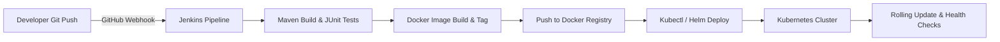

# CineX — System Architecture, CI/CD Roadmap & Fail-Safe Strategy

This document serves as both the **Production GitHub `README.md`** for the CineX project and an **Architectural Deployment & Reliability Strategy Report**.

---

# 🎬 CineX — Modern Movie Ticketing & Multiplex Platform

[](https://www.oracle.com/java/)
[](https://spring.io/projects/spring-boot)
[](https://react.dev/)
[](https://www.typescriptlang.org/)
[](https://www.docker.com/)
[](https://www.postgresql.org/)
[](https://redis.io/)

CineX is a feature-rich, high-performance web platform for online movie booking and multiplex theatre management. It provides end-to-end capabilities for consumers (movie discovery, real-time seat selection, booking, and ticket generation) and theatre vendors (screen management, show scheduling, pricing rules).

---

## 🏛️ System Architecture Overview

CineX is currently deployed as a **Containerized Monolith** on a cloud VPS instance, designed with microservices-ready modular domain boundaries.

```
                  ┌──────────────────────────────────────────────┐
                  │                 Internet                     │
                  └──────────────────────┬───────────────────────┘
                                         │ HTTPS (Port 443 / 80)
                                         ▼
                  ┌──────────────────────────────────────────────┐
                  │              Nginx Reverse Proxy             │
                  └──────────────┬────────────────┬──────────────┘
                                 │                │
           /api/* (Backend)      │                │  /* (Frontend)
                                 ▼                ▼
    ┌──────────────────────────────────┐   ┌──────────────────────────────┐
    │     CineX Backend Container      │   │   CineX Frontend Container   │
    │  Spring Boot (Java 21) :9090     │   │   React 19 + Vite + Nginx    │
    └──────┬────────────────────┬──────┘   └──────────────────────────────┘
           │                    │
           ▼                    ▼
┌──────────────────┐   ┌──────────────────┐
│ PostgreSQL 15    │   │ Redis 7 Cache    │
│ (cinexdb :5434)  │   │ (:6381)          │
└──────────────────┘   └──────────────────┘
```

### Tech Stack
- **Frontend**: React 19, TypeScript, Vite, Tailwind CSS v4, Lucide React, Axios, React Router v7
- **Backend**: Java 21, Spring Boot 3.x, Spring Security (JWT), Spring Data JPA, Hibernate, Actuator
- **Data & Caching**: PostgreSQL 15, Redis 7 (Session & Catalog Caching)
- **Infrastructure & Networking**: Docker, Docker Compose, Nginx, Let's Encrypt SSL Certbot

---

## 🚀 CI/CD & Kubernetes Orchestration Roadmap



### Phase 1: Automated Integration (Jenkins Pipeline)
1. **Webhook Triggering**: Any commit/merge to `main` triggers a Jenkins build pipeline via GitHub Webhooks.
2. **Automated Testing & Quality Gate**: Maven compiles code, executes unit & integration tests, and runs static code analysis (SonarQube).
3. **Containerization**: Jenkins builds version-tagged Docker images for both backend and frontend, then pushes them to Docker Hub / Private Container Registry.

### Phase 2: Kubernetes (K8s) Production Orchestration
1. **Declarative Deployments**: Kubernetes `Deployment` manifests manage rolling updates with zero downtime.
2. **Services & Ingress Controller**: `Nginx Ingress Controller` handles SSL termination, routing, and path-based dispatching (`/` to Frontend, `/api` to Backend).
3. **Stateful Persistence**: PostgreSQL and Redis run with `PersistentVolumeClaims (PVC)` or leverage managed cloud database services (e.g., AWS RDS / ElastiCache).

---

## 🛡️ Recommended Fail-Safe & Resilience Mechanisms

To guarantee high availability, system stability, and automated recovery, the following fail-safe measures are incorporated into the operational blueprint:

### 1. Zero-Downtime Rolling Updates & Auto-Rollback
- **Kubernetes Rolling Update Strategy**: Ensures new container pods are spun up and verified healthy before old pods are terminated.
- **Automated Rollback**: If a newly deployed pod fails health checks or throws fatal runtime errors, Kubernetes automatically rolls back to the previous stable Deployment revision (`kubectl rollout undo`).

### 2. Liveness & Readiness Probes
- **Readiness Probe (`/actuator/health/readiness`)**: Ensures traffic is sent to backend pods only after DB connections, Redis pools, and JPA entity managers are fully initialized.
- **Liveness Probe (`/actuator/health/liveness`)**: Automatically restarts container instances if thread deadlocks or out-of-memory states occur.

### 3. Circuit Breakers & Rate Limiting
- **Resilience4j / Spring Cloud Circuit Breaker**: Prevents cascading failures during external service degradation (e.g., payment gateways or email SMTP services).
- **Nginx & Redis Rate Limiting**: Protects sensitive endpoints (`/api/v1/auth/login`, booking confirmation APIs) against DDoS and brute-force attacks.

### 4. Database Resilience & Automated Backups
- **Automated Daily Backups**: Cron jobs executing `pg_dump` with S3/remote storage replication.
- **Connection Pooling**: HikariCP tuned with leak detection, connection timeouts, and dynamic retry intervals.

### 5. Centralized Observability & Alerting
- **Prometheus & Grafana**: Monitors JVM memory usage, HTTP response latencies, active DB connections, and error rates.
- **Alertmanager**: Sends real-time alerts (Slack / Email) when HTTP 5xx error rates spike or container restarts recur.

---

## 🛠️ Local Development & Quick Start

### Prerequisites
- Java 21 JDK
- Node.js 20+ & npm
- Docker & Docker Compose

### Running Locally with Docker Compose
```bash
# Clone repository
git clone https://github.com/arghya-align-pix-design/CineX.git
cd CineX

# Start Infrastructure (PostgreSQL & Redis)
docker-compose up -d

# Run Backend
cd cinex
./mvnw spring-boot:run

# Run Frontend (in separate terminal)
cd cineX_Frontend
npm install
npm run dev
```

---

## 📄 License
This project is licensed under the MIT License — see the `LICENSE` file for details.
